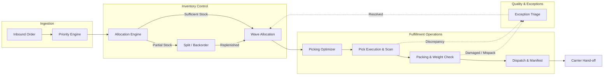

# 📦 WAREFLOW | Intelligent Warehouse Operations Platform

[](https://www.typescriptlang.org/)
[](https://reactjs.org/)
[](https://vitejs.dev/)
[](https://tailwindcss.com/)
[](https://github.com/pmndrs/zustand)
[](https://firebase.google.com/)
[](https://vitest.dev/)
[](LICENSE)

> **"See the stock. Predict the bottleneck. Move the order."**  
> **WAREFLOW** is a real-time, algorithmic warehouse operations and fulfillment management system designed for modern distribution centers, 3PL logistics, and high-throughput fulfillment hubs.

---

## 📑 Table of Contents

- [Overview](#-overview)
- [Key Architectural Engines](#-key-architectural-engines)
- [Feature Matrix](#-feature-matrix)
- [Fulfillment Pipeline](#-fulfillment-pipeline)
- [Tech Stack](#-tech-stack)
- [Project Structure](#-project-structure)
- [Getting Started](#-getting-started)
  - [Prerequisites](#prerequisites)
  - [Installation](#installation)
  - [Environment Configuration](#environment-configuration)
  - [Running the App](#running-the-app)
  - [Running Test Suites](#running-test-suites)
- [Firebase & Offline Resilience](#-firebase--offline-resilience)
- [Core Scripts](#-core-scripts)
- [Contributing & License](#-contributing--license)

---

## 🌟 Overview

Modern fulfillment centers struggle with order backlogs, stock misallocations, sub-optimal picking travel distances, and unexpected SLA breaches. **WAREFLOW** addresses these challenges by combining real-time inventory telemetry with intelligent algorithmic engines that guide warehouse operators and shift managers at every stage of fulfillment.

### Why WAREFLOW?
- **⚡ Algorithmic Stock Allocation**: Evaluates inventory availability across bins and recommends full, partial, or split-hold strategies.
- **🧭 Route-Optimized Picking**: Calculates snake/S-shape traversal routes across warehouse aisles to minimize operator footsteps.
- **🚨 Proactive Bottleneck Detection**: Monitors queue latencies between receiving, picking, packing, and dispatch to alert supervisors before SLA breaches happen.
- **🎯 Dynamic Order Priority Scoring**: Weighs customer tiers (Enterprise VIP vs Standard), SLA deadlines, express shipping methods, and aging order values.
- **🛡️ Resilient Dual-Mode Data Layer**: Connects directly to Google Cloud Firestore with multi-tab offline persistence, with an instant zero-configuration local mock fallback for standalone demos.

---

## 🧠 Key Architectural Engines

All decision-making engines are built as pure, highly-tested TypeScript modules located in [`src/engines`](file:///src/engines):

```
src/engines/
├── priorityEngine.ts        # Dynamic SLA & Customer Tier Priority Scoring
├── allocationEngine.ts      # Multi-SKU Stock Allocation & Strategy Decision Tree
├── pickingOptimizer.ts      # Warehouse Zone / Bin Route Sequencer (TSP heuristic)
├── stockForecastEngine.ts   # Daily Velocity & Days-of-Supply Stockout Predictor
├── bottleneckDetector.ts    # Station Queue Congestion & Latency Analyzer
└── exceptionEngine.ts       # Automated Triage & 1-Click Resolution Engine
```

### 1. Order Priority Engine (`priorityEngine.ts`)
Calculates a unified priority score ($0 - 100$) for each inbound order by factoring in:
- **SLA Countdown & Tightness**: Escalates score rapidly as deadlines approach.
- **Customer Tier**: Weighted bonuses for `ENTERPRISE_VIP` and `STRATEGIC` accounts.
- **Carrier Urgency**: Elevates `SAME_DAY` and `FEDEX_PRIORITY` / `EXPRESS` shipments.
- **Order Dollar Value & Volume**: Balances high-value orders with aging queue time.

### 2. Allocation Engine (`allocationEngine.ts`)
Evaluates line items against real-time on-hand, allocated, and reserved quantities:
- **Full Allocation (`FULL`)**: Marks order ready for wave creation.
- **Partial Allocation (`PARTIAL_SPLIT_HOLD`)**: Allocates available stock and creates a backorder split for remaining units.
- **Stock Depletion (`BACKORDER_WAIT`)**: Flags items for emergency replenishment or supplier drop-ship.

### 3. Picking Route Optimizer (`pickingOptimizer.ts`)
Sequences multi-item pick lists into an optimized travel path through warehouse zones ($A \rightarrow B \rightarrow C \rightarrow D$) and bin coordinates (`Zone-Aisle-Rack-Shelf`), minimizing reverse travel and aisle congestion.

### 4. Stock Forecast Engine (`stockForecastEngine.ts`)
Forecasts depletion dates based on rolling 7-day SKU velocity, calculating:
- **Days of Supply Remaining (DOS)**
- **Reorder Trigger Warning**: Flags SKUs when `Quantity Available ≤ Reorder Point`.
- **Critical Stockout Horizon**: Categorizes items into `CRITICAL`, `WARNING`, or `HEALTHY`.

### 5. Bottleneck Detector (`bottleneckDetector.ts`)
Monitors real-time queue depths and processing cycle times across operational stations:
- Receiving $\rightarrow$ Allocation $\rightarrow$ Picking $\rightarrow$ Packing $\rightarrow$ Inspection $\rightarrow$ Dispatch.
- Flags bottleneck stations exceeding SLA queue capacity thresholds.

### 6. Exception Triage Engine (`exceptionEngine.ts`)
Categorizes discrepancies (damaged inventory, barcode mismatch, address failure, missing items) and suggests 1-click remediation actions with audit trails.

---

## 🚀 Feature Matrix

| Module | Features & Capabilities |
|---|---|
| **📊 Executive Dashboard** | Real-time throughput metrics, active shift efficiency, live telemetry feed, bottleneck radar, SLA risk countdowns. |
| **📋 Orders Management** | Filterable order queues, customer tier badges, priority sorting, multi-line order detail drawer, carrier tracking. |
| **📦 Inventory & Multi-Zone Bins** | Multi-zone bin hierarchy (`Zone-Aisle-Rack-Shelf`), SKU search, on-hand/allocated/damaged counters, batch adjustments, velocity analytics. |
| **⚡ Smart Allocation** | Real-time batch allocation engine, stock split simulation, reservation locking, inventory short-ship handling. |
| **🛒 Wave & Batch Picking** | Step-by-step picking list, route sequence mapping, barcode scan verification, picker assignment, batch progress tracking. |
| **🎁 Packing Station** | Carton size recommendation, weight verification check, packing slip generator, carton seal validation. |
| **🚚 Dispatch & Shipping** | Carrier manifest generation (FedEx, UPS, DHL, Freight), tracking code assignment, outbound dock loading confirmation. |
| **⚠️ Exception Radar** | Live triage dashboard, discrepancy resolution workflows, priority escalation, supervisor audit logging. |
| **📈 Analytics & Reporting** | Daily order throughput, zone velocity heatmaps, operator productivity leaderboards, SLA compliance history. |
| **⚙️ Facility Settings** | Facility operating hours, shift management, SLA thresholds, Firestore cloud sync indicator, mock data reset. |

---

## 🔄 Fulfillment Pipeline



---

## 💻 Tech Stack

- **Core & UI Framework**: [React 18](https://react.dev/) + [TypeScript](https://www.typescriptlang.org/)
- **Build Tooling & Dev Server**: [Vite 5](https://vitejs.dev/) with React Fast Refresh
- **Styling & Design System**: [Tailwind CSS 3.4](https://tailwindcss.com/), [PostCSS](https://postcss.org/), [Radix UI Primitives](https://www.radix-ui.com/)
- **Icons & Typography**: [Lucide React](https://lucide.dev/), Inter & JetBrains Mono (Google Fonts)
- **Charts & Data Visualizations**: [Recharts 2](https://recharts.org/)
- **Micro-Animations**: [Framer Motion 11](https://www.framer.com/motion/)
- **State Management**: [Zustand 5.0](https://github.com/pmndrs/zustand) (Modular stores for orders, inventory, telemetry, exceptions, UI)
- **Database & Persistence**: [Firebase Firestore 12](https://firebase.google.com/docs/firestore) with multi-tab offline cache and local mock fallback
- **Test Runner & Assertions**: [Vitest 2.1](https://vitest.dev/)

---

## 📁 Project Structure

```
wms/
├── public/                     # Static assets & public icons
├── src/
│   ├── app/
│   │   ├── App.tsx             # Root application component
│   │   ├── providers.tsx       # UI & context providers
│   │   └── router.tsx          # React Router v6 route configuration
│   ├── components/
│   │   ├── common/             # Reusable cards, status badges, metric widgets
│   │   ├── inventory/          # Bin visualizers, SKU cards, adjustment dialogs
│   │   ├── layout/             # AppShell, Navigation Sidebar, Top Header
│   │   ├── orders/             # Order tables, status chips, timeline components
│   │   ├── ui/                 # Radix UI wrapper components (dialog, tabs, tooltips)
│   │   └── warehouse/          # Zone maps, bottleneck widgets, telemetry indicators
│   ├── data/                   # Comprehensive seed datasets (orders, inventory, SKUs, zones)
│   ├── engines/                # Core pure algorithmic calculation engines
│   │   ├── allocationEngine.ts
│   │   ├── bottleneckDetector.ts
│   │   ├── exceptionEngine.ts
│   │   ├── pickingOptimizer.ts
│   │   ├── priorityEngine.ts
│   │   └── stockForecastEngine.ts
│   ├── features/               # Route pages and domain feature modules
│   │   ├── allocation/         # Allocation management & batch simulator
│   │   ├── analytics/          # SLA, throughput & velocity metrics
│   │   ├── dashboard/          # Central operational overview
│   │   ├── dispatch/           # Carrier manifests & dock loading
│   │   ├── exceptions/         # Discrepancy triage & resolution
│   │   ├── inventory/          # SKU search, bin management, stock adjustments
│   │   ├── orders/             # Order list, filters & order details
│   │   ├── packing/            # Packing validation & label generation
│   │   ├── picking/            # Wave picking & route guidance
│   │   └── settings/           # Facility parameters & cloud status
│   ├── lib/
│   │   ├── constants.ts        # Warehouse zones, carrier codes, order statuses
│   │   ├── firebase.ts         # Firebase SDK initialization with offline persistence
│   │   ├── formatters.ts       # Currency, date, weight, and bin formatters
│   │   └── utils.ts            # Tailwind class merger & helper utilities
│   ├── services/               # Firestore integration & data access layer
│   │   ├── inventoryService.ts
│   │   ├── orderService.ts
│   │   ├── exceptionService.ts
│   │   ├── seedService.ts
│   │   └── settingsService.ts
│   ├── store/                  # Zustand stores
│   │   ├── useInventoryStore.ts
│   │   ├── useOrderStore.ts
│   │   ├── useExceptionStore.ts
│   │   ├── useWarehouseStore.ts
│   │   ├── useSettingsStore.ts
│   │   └── useUIStore.ts
│   ├── styles/                 # Global styles and Tailwind configuration
│   ├── types/                  # TypeScript domain models and interfaces
│   └── main.tsx                # Application entry point
├── tests/
│   ├── engines.test.ts         # Unit test suite for all algorithmic engines
│   └── firebase-services.test.ts # Resiliency & mock fallback tests
├── firestore.rules             # Cloud Firestore security rules
├── firestore.indexes.json      # Firestore composite query index definitions
├── vitest.config.ts            # Vitest test configuration
├── tailwind.config.js          # Tailwind theme & color token config
└── vite.config.ts              # Vite configuration
```

---

## 🛠️ Getting Started

### Prerequisites
- **Node.js**: v18.0.0 or higher
- **npm**: v9.0.0 or higher (or `pnpm` / `yarn`)

### Installation

1. **Clone the repository**:
   ```bash
   git clone <repo-url>
   cd wms
   ```

2. **Install dependencies**:
   ```bash
   npm install
   ```

### Environment Configuration

Copy the example environment file to `.env`:

```bash
cp .env.example .env
```

Edit `.env` to configure your warehouse parameters and optional Firebase project:

```env
# Warehouse Facility Configuration
VITE_WAREHOUSE_ID=wh-alpha
VITE_WAREHOUSE_NAME="Chicago Central Fulfilment (Alpha)"

# Telemetry Sync Interval (ms)
VITE_TELEMETRY_SYNC_INTERVAL_MS=15000

# Optional: Firebase Cloud Firestore Credentials
# (If omitted, WAREFLOW runs seamlessly in local in-memory fallback mode)
VITE_FIREBASE_API_KEY=
VITE_FIREBASE_AUTH_DOMAIN=
VITE_FIREBASE_PROJECT_ID=
VITE_FIREBASE_STORAGE_BUCKET=
VITE_FIREBASE_MESSAGING_SENDER_ID=
VITE_FIREBASE_APP_ID=
```

### Running the App

Start the Vite development server with Hot Module Replacement:

```bash
npm run dev
```

Open your browser and navigate to `http://localhost:5173`.

### Running Test Suites

Run the comprehensive unit test suite powered by Vitest:

```bash
npm test
```

To run tests in watch mode during engine development:
```bash
npx vitest
```

---

## 🛡️ Firebase & Offline Resilience

WAREFLOW is built to be cloud-ready and production-resilient:

1. **Zero-Config In-Memory Fallback**: If no Firebase credentials are provided in `.env`, the platform automatically operates in local mode using rich seed datasets for orders, SKUs, inventory, and zones.
2. **Multi-Tab IndexedDB Persistence**: When connected to Cloud Firestore, `persistentLocalCache` with `persistentMultipleTabManager` is enabled, allowing seamless offline operations across multiple warehouse terminal tabs.
3. **Graceful Error Translation**: Network failures, permission denials, or doc missings are translated into non-blocking UI notifications without crashing operational workflows.

---

## 📜 Core Scripts

| Command | Description |
|---|---|
| `npm run dev` | Starts the Vite development server (default port `5173`). |
| `npm run build` | Runs TypeScript type checking (`tsc -b`) and produces an optimized production bundle in `dist/`. |
| `npm run preview` | Serves the production build locally for QA and validation. |
| `npm test` | Executes all unit tests with Vitest. |

---

## 📄 License

This project is open-sourced under the [MIT License](LICENSE).

---

<p align="center">
  <b>Built with ⚡ for high-efficiency warehouse logistics.</b>
</p>
